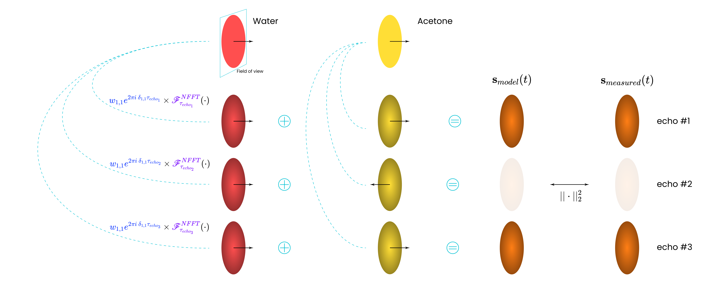

# Rapid quantitative chemical composition mapping using model-based MRI reconstruction with field inhomogeneity correction

Implementation of the model-based MRI reconstruction method for rapid quantitatification of the chemical composition with field inhomogeneity correction.



## Installation

The code has been developed and tested on Ubuntu 24.04.4 LTS.

Before proceeding, ensure you have the following software installed:
- [Git](https://git-scm.com/install)
- [Conda](https://github.com/conda-forge/miniforge)
- [Juliaup](https://julialang.org/downloads/)

Once the prerequisites are met, you can set up the environment and install the necessary dependencies by running the following commands in your terminal:
```bash
git clone --recurse-submodules -j8 https://github.com/IBIResearch/chem-resolved-mri.git
cd chem-resolved-mri
conda env create --file env/python/environment.yml
conda activate chem-comp-mapping
juliaup add 1.9.4
juliaup add 1.12.7
julia +1.9.4 --project=env/julia -t 4 -e 'using Pkg; Pkg.develop(path="env/julia/libs/NFFT"); Pkg.develop(path="env/julia/libs/MRIReco.jl"); Pkg.instantiate(); Pkg.precompile()'
julia +1.12.7 --project=env/julia-varpro -t 4 -e 'using Pkg; Pkg.instantiate(); Pkg.precompile()'
```


Download the data from the [here](https://doi.org/10.15480/882.17645), place it in the `data/raw` directory. You should end up with the following structure:
```
├── B0-map-validation.h5
├── composition-dependent-spectra.h5
├── field_inhomogeneity.h5
├── multipeak_spectra.h5
├── ratio_series_1.h5
├── ratio_series_2.h5
├── ratio_series_3.h5
├── ratio_series_4.h5
├── ratio_series_5.h5
├── ratio_series_6.h5
├── ratio_series_7.h5
├── README.md
└── sequence-variations
    ├── fa10.h5
    ├── fa15.h5
    ├── fa20.h5
    ├── fa25.h5
    ├── fa30.h5
    ├── fa5.h5
    ├── tr1000.h5
    ├── tr100.h5
    ├── tr150.h5
    ├── tr200.h5
    ├── tr300.h5
    └── tr500.h5
```

## Structure and usage
There are 3 experiments under `experiments/`. In general, each contains a `reco.jl` script for reconstruction and an `analysis.py` script for result processing. Specific instructions are provided in each experiment folder.


## Citation
If you use this code in your research, please cite the following paper:

```bibtex
@misc{tsanda_rapid_chem_comp_2026,
	title = {Rapid quantitative chemical composition mapping using model-based MRI reconstruction with field inhomogeneity correction,
	url = {https://arxiv.org/abs/2607.24441},
	urldate = {2026-07-28},
	publisher = {arXiv},
	author = {Tsanda, Artyom and Benders, Stefan and Adrian, Muhammad and Penn, Alexander and Knopp, Tobias},
	month = july,
	year = {2026},
}
```

## License
The code has an MIT license, as found in the LICENSE file.
